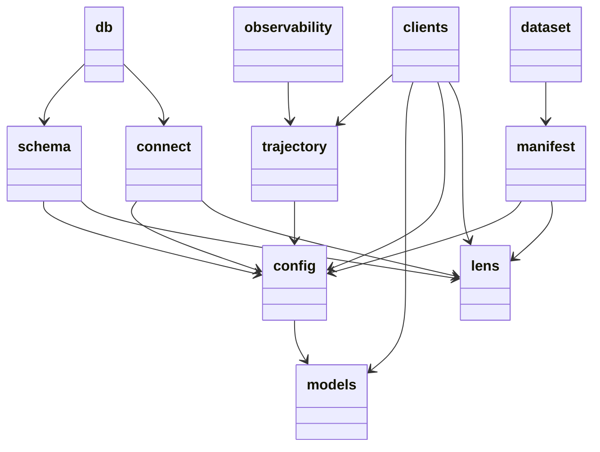
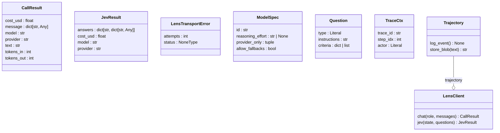
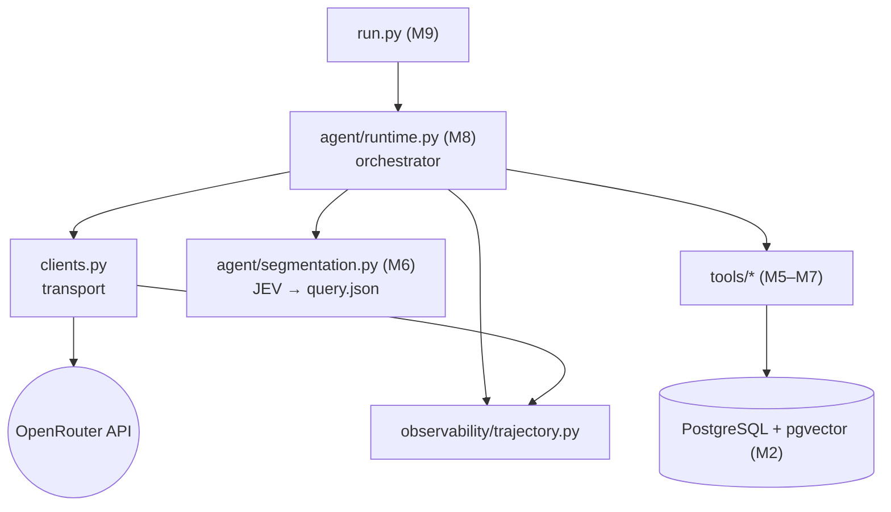
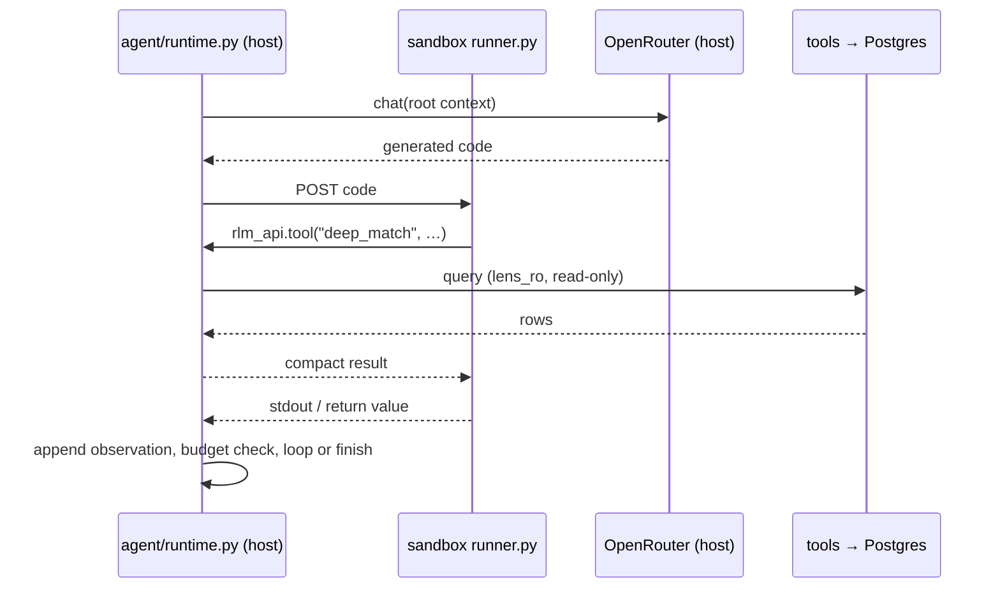

# LENS — Architecture & Module Interactions

> **Purpose:** document how the LENS harness modules and classes interact, for the
> weekly advisor review. Companion to `Thesis Drafts/Tech Stack (Draft).md` §4a/§4d
> (harness architecture + module map), which is thesis-side; this file is the
> **repo-side** engineering view.
>
> **Status:** covers the built layers **M0–M2** plus the planned M5–M9 shape.
> Regenerate the structural diagrams after M5/M8 (see §5).
>
> **Owner:** LENS thesis student. **Assistant-authored draft.**

---

## 1. Layered overview

Two runtimes, **one-way imports**:

- **Host** (Windows-native Python 3.12) owns the loop, the API key, the DB
  credentials, and the logs.
- **Sandbox** (`lens-repl`, M8) executes the RLM's generated Python only. It holds
  **no key and no DB driver**; every external effect is an RPC back to the host.

| Module | Responsibility | Imports |
|---|---|---|
| `src/lens/models.py` | Shared types: `Role`, `CallResult`, `JevResult`, `Question`. No project imports (bottom of the graph). | stdlib + `pydantic` |
| `src/lens/config.py` | Paths, endpoints, guardrails, DB settings, `MODEL_REGISTRY`, `JEV_MODEL_ID`, `require_api_key()`. | `models` |
| `src/lens/observability/trajectory.py` | Injected sink: `Trajectory` (content-addressed blobs + one-schema JSONL) and `TraceCtx`. | `config` |
| `src/lens/clients.py` | Transport: `LensClient.chat()` / `.jev()` — auth, retries, provider pinning, `usage`/cost. Stateless. | `config`, `models`, `trajectory` |
| `src/lens/dataset/manifest.py` | M1: single-pass cs.AI filter → `manifest.json` + JSONL checkpoint. | `config` |
| `src/lens/db/connect.py` | M2: `connect(readonly=…)` → psycopg connection (admin / `lens_ro`). | `config` |
| `src/lens/db/schema.py` | M2: idempotent pgvector migration + `tables_exist()`. | `config` |
| `src/lens/tools/*` *(M5–M7)* | Host tools: `shallow_match`, `rerank_papers`, `deep_match`, `rerank_chunks`, `build_kg`, `evaluate_stage`. | `config`, DB driver |
| `src/lens/agent/runtime.py` *(M8)* | Orchestrator: owns the loop, context compaction, sub-calls, budget, ledger. | `clients`, `tools`, `trajectory` |
| `src/lens/sandbox/{runner,rlm_api}.py` *(M8)* | Passive executor + façade (`tool()` / `sub_call()` / `budget()` / `emit()` / `note()`). | sandbox only |
| `src/lens/run.py` *(M9)* | Entry point: `python -m lens.run "<query>"`. | `agent.runtime` |

**Import direction (no cycles):** `models` ← `config` ← {`trajectory`, `clients`,
`manifest`, `connect`, `schema`} ← `agent.runtime` ← `run`.

---

## 2. Module dependency graph (auto-generated)

Source: `docs/packages_lens.mmd` (pyreverse). Edges are file-level imports.



> The `lens` nodes are package `__init__` re-exports (`db → connect`, `db → schema`,
> `dataset → manifest`); `observability → trajectory` is the same pattern.

---

## 3. Class map (auto-generated)

Source: `docs/classes_lens.mmd` (pyreverse). Attributes/methods omitted for width.



**Key interactions (built):**
- `LensClient.__init__` takes a `Trajectory` (the `--o` composition): every
  `chat()`/`jev()` call stores blobs and logs exactly one event.
- `LensClient` resolves its model through `config.MODEL_REGISTRY` (`ModelSpec`),
  validated JEV inputs via `Question`, and returns `CallResult` / `JevResult`.
- `db.connect()` returns a raw `psycopg.Connection`; `db.schema` operates on it.

---

## 4. Runtime interactions (not visible in import graphs)

The important flows are **runtime**, not imports — this is the part a static tool
cannot produce.

### 4.1 Request path (M8 target)



### 4.2 Host ↔ sandbox loop (M8, `Tech Stack §4a`)

The host pulls every turn; the sandbox is a **passive** executor. The DB and the
LLM are reached **only** from the host — the sandbox never holds the key or a DB
driver.



> `db/connect.py` is used **only** by the host side of this loop (the tool layer),
> never imported by the sandbox.

---

## 5. Regenerating the diagrams

The `.mmd` files are generated by **pyreverse** (ships with `pylint`); no
Graphviz is required for Mermaid output. Run from the repo root:

```powershell
uv run --with pylint --no-project pyreverse -o mmd -d docs -p lens src/lens
```

This rewrites `docs/packages_lens.mmd` and `docs/classes_lens.mmd`. Paste any
changes into §2/§3 above (or regenerate on the next milestone).

Optional crisp SVG/PNG: install Graphviz, then
`uv run --with pylint --no-project pyreverse -o png -d docs -p lens src/lens`.

---

## 6. Notes and caveats

- Only the **built** modules (M0–M2) appear in the generated graphs; `tools/`,
  `agent/`, `sandbox/`, `run.py` are planned (M5–M9) and shown dashed in §4 only.
- Static graphs show **imports and classes**, not the host↔sandbox RPC or the DB
  access path; §4 covers those.
- One-way import direction is the invariant to keep; a future
  [`import-linter`](https://import-linter.readthedocs.io/) contract could enforce
  it in tests (not added yet).
